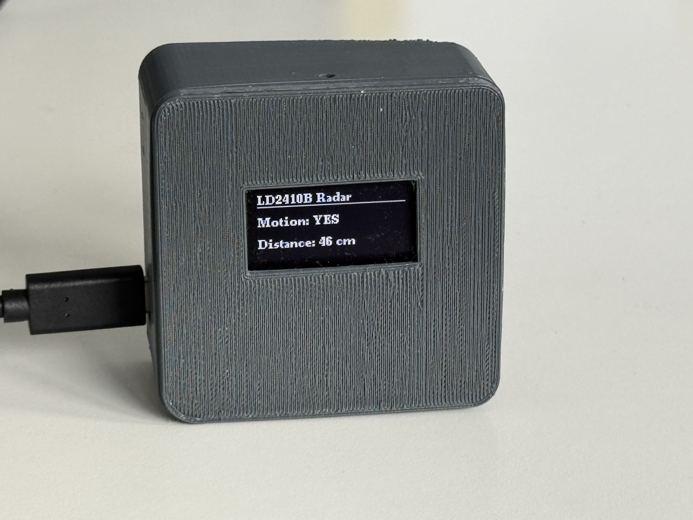

# ESP32 Presence OLED

ESP32-based presence monitor built around the **LD2410B-P** 24 GHz radar sensor, an **SH1106 128x64 OLED** display, and **MQTT** publishing over Wi-Fi.

The firmware reads motion and distance data from the radar sensor over UART, shows live status on the OLED, and publishes presence updates to an MQTT broker for home automation or logging workflows.



## Features

- Reads presence and moving target distance from an LD2410 radar sensor
- Displays motion, distance, and Wi-Fi status on a 128x64 OLED
- Connects to Wi-Fi in station mode
- Publishes online status, motion state, and distance to MQTT topics
- Uses PlatformIO for dependency management and builds

## Hardware

- Generic ESP32 development board
- LD2410B-P presence radar sensor
- SH1106 128x64 OLED display
- Jumper wires and power supply
- Optional printed enclosure from Thingiverse:
  [Radar Presence Sensor Case](https://www.thingiverse.com/thing:6829871)

## Wiring Overview

The firmware uses the following UART connection for the radar module:

| Signal | ESP32 pin | Status |
| --- | --- | --- |
| LD2410 TX | GPIO16 | Used by the firmware |
| LD2410 RX | GPIO17 | Used by the firmware |
| VCC | 3.3V | Provided in project notes |
| GND | GND | Provided in project notes |

The OLED is initialized with hardware I2C, but the exact pins and address are not explicitly set in code.

- Typical ESP32 I2C defaults are often: SDA `GPIO21`, SCL `GPIO22`
- OLED I2C displays commonly use address `0x3C`, but this should be verified on your hardware

Additional hardware notes and troubleshooting are available in [docs/hardware.md](docs/hardware.md).

## Software Stack

- **Arduino framework for ESP32**: base runtime used by PlatformIO
- **WiFi.h**: connects the ESP32 to the local network
- **PubSubClient**: publishes radar state to an MQTT broker
- **U8g2**: drives the SH1106 OLED display
- **ld2410**: reads presence and distance data from the radar sensor

## PlatformIO Environment

The project currently uses this PlatformIO environment:

- Environment: `esp32dev`
- Platform: `espressif32`
- Framework: `arduino`
- Monitor speed: `115200`

Declared libraries in `platformio.ini`:

- `olikraus/U8g2`
- `ncmreynolds/ld2410@^0.1.4`
- `knolleary/PubSubClient@^2.8`

## Configuration

This repository now keeps secrets out of version control.

1. Copy `include/config.example.h` to `include/config.h`
2. Update the Wi-Fi and MQTT values in `include/config.h`
3. Build and upload as usual with PlatformIO

`include/config.h` is ignored by Git and should stay local.

## Build and Upload

Typical PlatformIO workflow:

```bash
pio run
pio run --target upload
pio device monitor
```

If you use the PlatformIO VS Code extension, opening the folder is enough for dependency resolution and build tasks.

## MQTT Topics

The current firmware publishes:

- `home/ld2410/status`
- `home/ld2410/motion`
- `home/ld2410/distance`

The MQTT broker address, credentials, and client ID are configured in `include/config.h`.

## Interfaces Used

- **UART**: used for communication with the LD2410 radar sensor
- **I2C**: used by the OLED display through the ESP32 hardware I2C peripheral
- **Wi-Fi**: used for network connectivity
- **MQTT**: used for telemetry and integration

SPI is not used by the current firmware.


## License

This project is released under the [MIT License](LICENSE).
